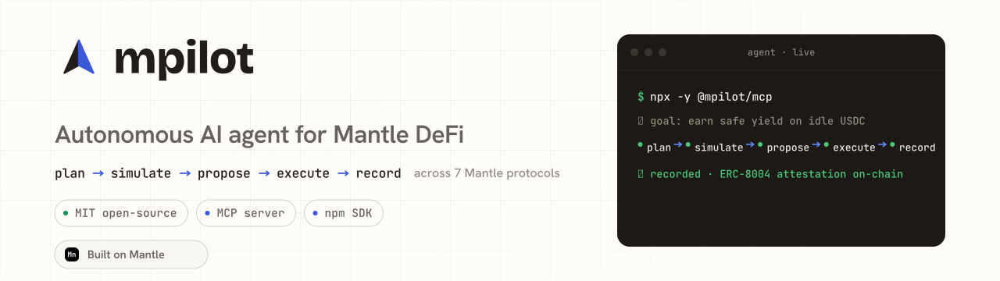
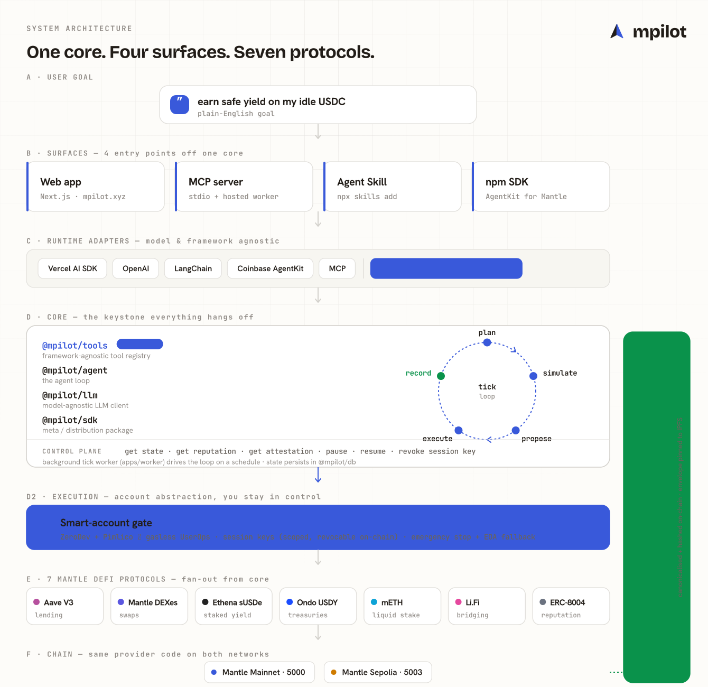
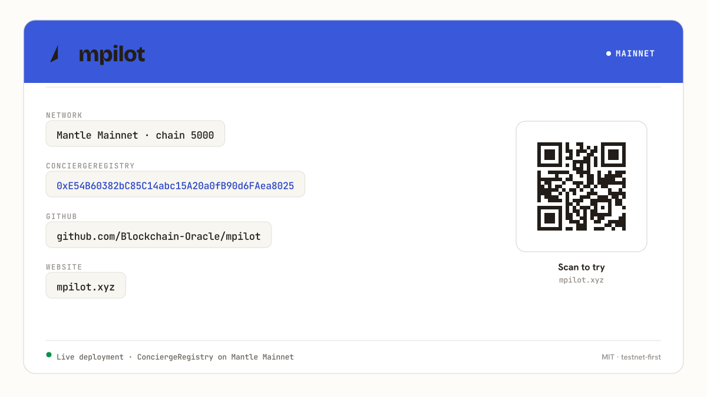

<p align="center">
  <picture>
    <source media="(prefers-color-scheme: dark)" srcset="./assets/banner-dark.svg">
    
  </picture>
</p>

<h1 align="center">mPilot</h1>

<p align="center">
  <b>An AI agent that manages your DeFi yield on Mantle — 24/7, on-chain, and verifiable.</b><br/>
  You set a goal in plain English. mPilot does the rest, and proves every move on-chain.
</p>

<p align="center">
  <a href="https://mpilot.xyz">🌐 Live app</a> ·
  <a href="https://mpilot.xyz">▶️ 2-min demo</a> ·
  <a href="https://github.com/Blockchain-Oracle/mpilot">⭐ Code</a> ·
  <a href="https://www.npmjs.com/package/@mpilot/sdk">📦 npm</a> ·
  <a href="https://mantlescan.xyz/address/0xE54B60382bC85C14abc15A20a0fB90d6FAea8025">🔗 Mainnet contract</a> ·
  <a href="https://mantlescan.xyz/tx/0x5d0fcdd38f44b1a07e279562587cf03a655eeb3cf2ba3cc1e5e9dc7022cb80ed">✅ Live agent tx</a>
</p>
<p align="center"><sub>Mantle Turing Test 2026 · <b>AI × RWA</b> track · deployed & live on Mantle mainnet</sub></p>

> ℹ️ **Submitting:** replace the `🌐 Live app` and `▶️ 2-min demo` links above with the final deployed-app URL and the demo-video URL.

---

## The problem

Earning yield in DeFi is a full-time job. Rates move every block, positions drift out of balance, and a single missed liquidation can wipe you out. Nobody can watch it 24/7 — so most people either leave money on the table or get rekt. And when an "AI agent" *does* act for you, you usually have no way to check what it actually did or whether it was any good.

## What mPilot does

You give mPilot a goal — *"earn safe yield on my ETH"* — and it runs a continuous loop on Mantle:

1. 🧠 **Plan** — reads your goal + live on-chain rates, picks the best move
2. 🧪 **Simulate** — dry-runs it first (expected yield change, resulting health factor, risk flags)
3. 📋 **Propose** — shows the move with a plain-English reason (auto-approve, or you confirm)
4. ⚡ **Execute** — signs & sends the transaction via your ERC-4337 session key
5. 🔏 **Record** — writes an **ERC-8004 reputation attestation** on-chain, so the agent builds a permanent, auditable track record

It's not a chatbot with a wallet. It takes real actions across **7 Mantle protocols** (Aave V3, Mantle DEXes, Ethena sUSDe, Ondo USDY, mETH staking, Li.Fi bridge, ERC-8004) — and you can verify every single one on-chain.

## How it works (one picture)

<p align="center">
  
</p>

## The AI × RWA angle

This track is about **real-world-asset yield** on Mantle. mPilot acts on the two already tokenized there:

- **🏦 Ondo USDY — tokenized US Treasuries.** mPilot reads USDY's live redemption-price oracle to track real T-bill yield (~5%) on-chain.
- **🔷 mETH — ETH staking yield.** mPilot reads the mETH exchange rate (staking rewards accruing block by block) and can **enter and exit an mETH position** via DEX swap on Mantle.

Risk management is built in: simulate-before-execute, spending caps, health-factor checks, and a one-tap **Emergency Stop**.

## What makes it different — one brain, four front doors

Every other agent in this space is a single website. mPilot's core is a **composable primitive** — the *same* agent is usable from anywhere, and all of it is **published live on npm**:

| Surface | How you use it |
|---------|----------------|
| 🖥️ Web app | The flagship dashboard |
| 🔌 MCP server | `npx -y @mpilot/mcp` → runs inside Claude Desktop & any MCP host |
| 📦 npm SDK | `pnpm add @mpilot/sdk` → drop mPilot's DeFi tools into *your* agent |
| 🧩 Agent skill | `npx skills add Blockchain-Oracle/mpilot` → installs into agent hosts |

**22 packages are live under [`@mpilot/*`](https://www.npmjs.com/org/mpilot).** This is genuinely "AgentKit for Mantle," not just a demo app.

## Live on Mantle mainnet ✅

<p align="center">
  
</p>

| | Address / proof |
|---|---|
| Registry (UUPS proxy) | [`0xE54B…8025`](https://mantlescan.xyz/address/0xE54B60382bC85C14abc15A20a0fB90d6FAea8025) |
| Implementation | [`0xc784…4761`](https://mantlescan.xyz/address/0xc784362387E1DCD2A99D1000d9c852F4EA244761) |
| **Agent acting on-chain** | The agent registered its own **ERC-8004 identity (agent #133)** — [view tx](https://mantlescan.xyz/tx/0x5d0fcdd38f44b1a07e279562587cf03a655eeb3cf2ba3cc1e5e9dc7022cb80ed) |

## Run it yourself

**Use mPilot's tools in your own agent (no setup):**
```bash
pnpm add @mpilot/sdk @mpilot/agent
```
```ts
import { createConciergeClient } from '@mpilot/sdk';

const mpilot = createConciergeClient({ agentId: '133', baseUrl: 'https://mpilot.xyz' });
const rep = await mpilot.getReputation('133'); // the agent's on-chain track record
```

**Plug the agent into Claude Desktop:**
```bash
npx -y @mpilot/mcp
```

**Run the whole monorepo locally:**
```bash
git clone https://github.com/Blockchain-Oracle/mpilot.git
cd mpilot
pnpm install
pnpm -r build        # build all 22 packages
pnpm --filter @mpilot/web dev   # start the web app at http://localhost:3000
```
> Requires Node ≥ 22 and pnpm. Foundry is needed only for the `contracts/` package.

## Screenshots & demo

| | |
|---|---|
| ▶️ **2-min demo video** | _add link_ |
| 🌐 **Live app** | _add link_ |
| 🖼️ Architecture | [`assets/architecture.svg`](./assets/architecture.svg) |
| 🖼️ Deployment cards | [`assets/mainnet-card.svg`](./assets/mainnet-card.svg) · [`assets/testnet-card.svg`](./assets/testnet-card.svg) |

## Honest limitations & what's next

We'd rather tell you the truth than fake a number:

- **USDY is monitoring-only today.** Its on-chain yield is real and we read it live, but USDY's DEX liquidity on Mantle is currently thin — so we surface the opportunity instead of forcing a bad swap. mETH entry/exit *is* live.
- **mETH `acquire` is built + unit-tested but not yet wired into the live agent loop / UI** — it works at the provider level; integrating it end-to-end is the next step.
- **Next:** wire mETH acquire into the agent + dashboard, deepen USDY routing once liquidity arrives, and ship the public demo deployment.

## Built with

Mantle mainnet · ERC-8004 (on-chain agent identity + reputation) · ERC-4337 session keys · Aave V3 · Mantle DEXes (Merchant Moe / Agni / FusionX) · Ethena sUSDe · Ondo USDY · mETH · Li.Fi · TypeScript · Foundry · Vercel AI SDK + Model Context Protocol.

## Repo layout

```
packages/    22 published @mpilot/* libraries — agent core, tools, 7 providers, 4 adapters, MCP, SDK, UI
apps/        web (Next.js dashboard) + worker (autonomous tick loop)
contracts/   Foundry — the registry deployed to Mantle mainnet
submission/  DoraHacks pitch, demo script, X thread
assets/      brand kit + architecture diagram + deployment cards
docs/        architecture (ADRs), PRD, UX spec
```

## Team

- **Blockchain-Oracle** — [GitHub](https://github.com/Blockchain-Oracle)

---

<p align="center">
  <b>mPilot</b> — set a goal, let the agent earn, verify every move on-chain.<br/>
  <sub>Built for the Mantle Turing Test 2026 · AI × RWA · MIT licensed</sub>
</p>
